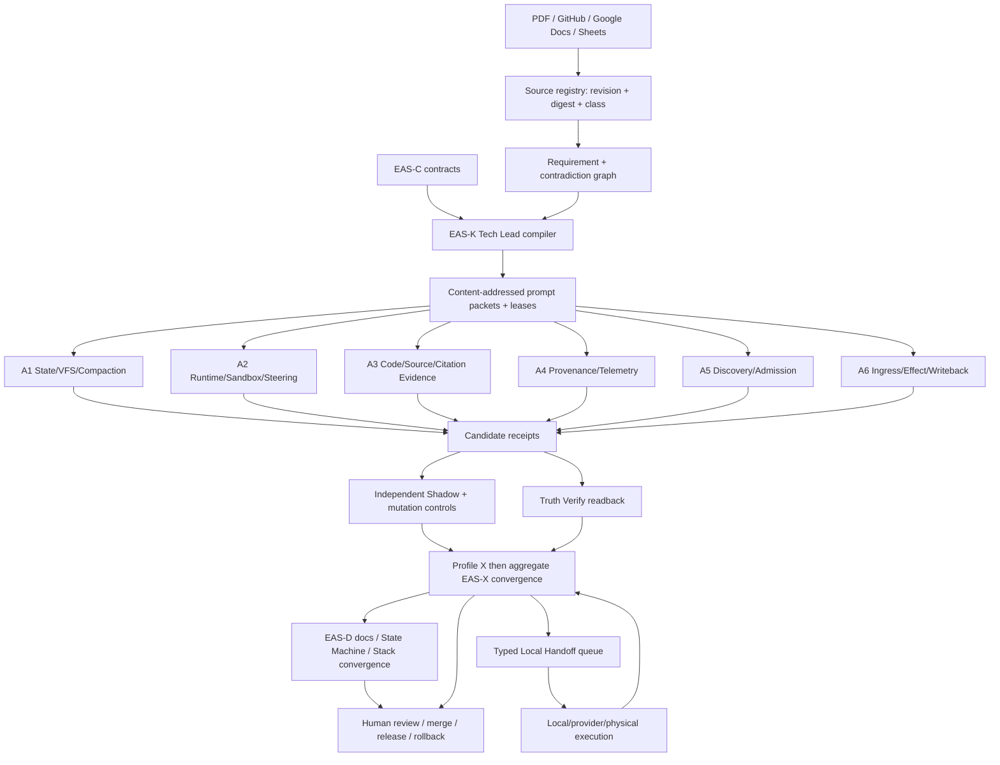

# enterprise_agent_system

Cross-repository **management, routing, traceability, and closure control plane** for enterprise Agent programs. It binds source proposals to immutable subjects, compiles Tech Lead task DAGs and zero-context prompt packets, reconciles independent Shadow findings, derives a Molecular Stack, and emits typed Local Handoff work without becoming a second runtime, workflow engine, VFS, effect ledger, verifier, or release authority.

> **Current verdict:** `DRAFT_CONTROL_PLANE_WITH_OPEN_EVIDENCE_LANES`. Draft PR #20 provides the generic control-plane contract candidate, PR #24 the Tech Lead DAG/reducer candidate, PR #25 the read-only Shadow candidate, and PR #21 the `Agent Thinking Inception` source/profile candidate. PR #26 is synchronized with the current profile parent and now carries documentation plus machine-readable DAG, Stack, directory/State-Machine, data-flow and closure candidates; exact-head documentation Gates and final X inputs remain open. No owner implementation, local/provider/physical canary, external effect, user outcome, Human admission, release, or rollback is closed.

## Why this repository exists

The source PDF proposes context compaction, VFS persistence, dynamic steering, parallel sub-agents, deterministic gates, citation repair, Code/Model/Data/Trace screening, continuous repository convergence, issue-triggered execution, Docker sandboxes, telemetry, and writeback. Its strongest production direction is **deterministic macro State Machine/DAG + bounded local Agent autonomy + external Domain State + independent gates**. The PDF itself remains a proposal: its sample in-memory VFS, fixed thresholds, token estimate, tool-call cut logic, “zero hallucination,” license/clean-room conclusions, local-telemetry safety, FastAPI background dispatch, webhook auth, and Docker isolation do not close the real problems by themselves.

The control plane converts that source into a falsifiable closure program:

```text
SOURCE_PROPOSAL
→ OWNER_AND_CONTRACT_BOUND
→ MECHANISM_IMPLEMENTED
→ DETERMINISTIC_EVIDENCE_VERIFIED
→ LIVE_OR_PHYSICAL_EVIDENCE_VERIFIED
→ USER_OUTCOME_VERIFIED
→ HUMAN_ADMITTED
→ RELEASED
→ OPERATED_WITH_ROLLBACK
```

Every transition requires its own exact-subject receipt. Issue closure, merged Markdown, a green CI job, a model agreement, a static fixture, or a provider acknowledgement cannot proxy a later lane.

## Repository role split

| Plane | Canonical repository | Owns | Does not own |
|---|---|---|---|
| Control / closure | `enterprise_agent_system` | source registry, requirement graph, task/prompt routing, owner bindings, closure projection, Stack index, handoff compilation | runtime, durable workflow, VFS, effect execution, independent truth, release |
| Portable method | `skills-shared` | Tech Lead, Shadow Architect, Git Town Stack, dual-forge and Local Handoff laws | repository-specific canonical state or provider execution |
| Runtime contract | `runtime-env` | secret-free capability, workload, identity, environment and carrier contracts | credential values, workflow/effect state, product behavior |
| Workflow/effect | `bettor-arena` | durable Domain State, reducer, timers/retry/cancel, VFS/compaction harness, effect ledger, vertical integration | provider-specific sandbox/API/browser implementations |
| Provider/runtime adapter | `agent-shield-monorepo` | hardened sandbox, model/runtime/provider, API/browser/webhook/telemetry adapters and live receipts | canonical EAS closure or Human release |
| Independent verification | `truth-verify-loop` | source/artifact/effect/user-result verification and disagreement receipts | implementation mutation or canonical reduction |
| Source anchoring | `openwiki-source-anchoring` | exact lexical quote/path/span anchors | semantic truth or release authority |

One interface or canonical state has one owner. EAS routes and reconciles; it does not copy owner implementations.

## Eight implementation phases

| Phase | Fresh-session role | Main output | Completion edge |
|---|---|---|---|
| P0 | Source & Authority Auditor | source digest, page map, complete requirement/contradiction denominator | every load-bearing claim has locator, owner, controls, evidence ceiling |
| P1 | Contract Lock Worker | generic and profile-specific strict schemas, examples, mutation controls | downstream packets consume exact contract versions/digests |
| P2 | Tech Lead Controller / DAG Compiler | capability/task/evidence DAGs, start/completion edges, prompt packets, leases | one canonical reducer admits candidate receipts |
| P3 | Parallel Owner Wave | A1–A6 owner packets and owner-repository implementations/receipts | each lane returns exact subject, gates, cleanup, rollback, blockers |
| P4 | Independent Shadow Architect | applicability, contradiction, mutation, false-promotion and global-objective verdict | every critical finding blocks or owns one open issue |
| P5 | Convergence Owner | cross-repo closure graph and one exact-subject vertical canary | all owner/evidence lanes reconciled without proxying |
| P6 | Docs / Stack Convergence | root routes, directory→State Machine index, DAG/data flow, prompt catalogue, Molecular Stack | documentation and machine indexes agree on exact current subjects |
| P7 | Local Handoff Compiler | one executable queue with concrete argv/cwd/timeout/receipts/cleanup/rollback | exact local/live/Human receipts advance one item at a time |

P3 fans out into six path/resource-disjoint lanes:

```text
A1 durable Domain State + VFS + context compaction + recovery
A2 runtime-env capabilities + hardened sandbox + safe steering
A3 exact code/source/citation evidence + repair
A4 Code/Model/Data/Trace provenance + sanitize-before-export telemetry
A5 discovery + adaptation + benchmark + admission
A6 durable ingress + queue + effect ledger + idempotent writeback
```

## Target directory structure

Status labels mean `IMPLEMENTED_IN_DRAFT`, `CONTRACT_CANDIDATE`, `PLANNED`, or `OWNER_EXTERNAL`; directory presence never proves runtime closure.

```text
enterprise_agent_system/
├── README.md                          # EAS-D root route and current verdict
├── AGENTS.md                          # cross-host operating contract
├── ARCHITECTURE.md                    # stable plane boundaries and invariants
├── CONTEXT.md                         # mutable handoff/current exact subjects
├── LICENSE                            # Apache-2.0
├── contracts/
│   └── control-plane/                 # EAS-C: source/binding/closure/run schemas
├── control-plane/
│   ├── router/                        # EAS-K: dependency and packet compilation
│   ├── reducer/                       # EAS-K: candidate reconciliation
│   ├── leases/                        # EAS-K: writer/path/resource admission
│   ├── gates/                         # EAS-E: independent read-only controls
│   └── state-machines/                # generic transition definitions
├── integrations/
│   ├── github/                        # EAS-A: issues/PR/commit/Actions projection
│   └── google-drive/                  # EAS-A: Docs/Sheets advisory projection
├── profiles/
│   └── agent-thinking-inception/
│       ├── AGENTS.md
│       ├── README.md
│       ├── source/                    # content digest and page map
│       ├── requirements/              # 15 requirements + 14 contradictions
│       ├── contracts/                 # source-specific contract bundle
│       ├── orchestration/             # profile K plan (planned)
│       ├── owners/
│       │   ├── compaction/            # A1 owner packet (planned)
│       │   ├── runtime/               # A2 owner packet (planned)
│       │   ├── evidence/              # A3 owner packet (planned)
│       │   ├── compliance/            # A4 owner packet (planned)
│       │   ├── discovery/             # A5 owner packet (planned)
│       │   └── ingress/               # A6 owner packet (planned)
│       ├── shadow/                     # profile E controls (planned)
│       ├── evidence/                   # exact-subject lane receipts (planned)
│       ├── plans/                      # K/X/D machine plans (planned)
│       ├── prompts/                    # zero-context phase/session packets
│       └── tests/                      # source/profile semantic controls
├── plans/
│   ├── task-dag.json                  # machine-readable program DAG candidate
│   ├── molecular-stack-index.json     # observed/planned C/K/A/E/X/D topology
│   ├── directory-state-machine-index.json
│   ├── data-flow.json
│   └── architecture-closure.json      # lane-literal closure candidate
├── prompts/
│   ├── 00-source-authority-auditor.system.md
│   ├── 01-contract-lock-worker.system.md
│   ├── 02-tech-lead-controller.system.md
│   ├── 03-owner-wave-worker.system.md
│   ├── 04-shadow-architect.system.md
│   ├── 05-convergence-owner.system.md
│   ├── 06-docs-stack-convergence.system.md
│   ├── 07-local-handoff-compiler.system.md
│   └── README.md
├── evidence/
│   ├── source-controls/
│   ├── shadow/
│   └── ledgers/
├── handoff/
│   ├── README.md
│   └── local-handoff-queue.json       # created only when concrete P7 epoch is valid
├── docs/
│   ├── INDEX.md
│   ├── architecture/
│   │   ├── STATE_MACHINES.md
│   │   └── DATA_FLOW.md
│   ├── integration/
│   ├── prompts/
│   └── traceability/
│       └── MOLECULAR_STACK_INDEX.md
├── scripts/
└── tests/
    └── verify_docs.py                 # DAG/Stack/data-flow/docs consistency Gate
```

## Directory → State Machine → DAG ownership

| Directory | State Machine | DAG atom/owner | Inputs | Outputs / next owner | Evidence ceiling |
|---|---|---|---|---|---|
| `contracts/control-plane/` | `UNBOUND → … → CONSUMER_READY` | EAS-C / #8 / PR #20 | source identity and plane laws | strict generic contracts → K/A/E | contract shape only |
| `control-plane/router|reducer|leases/` | `REQUEST_BOUND → … → DELIVERY_OR_HANDOFF` | EAS-K / #9 | frozen contracts/objective | packets, leases, candidate reduction → E/X | deterministic compilation only |
| `integrations/**` | `REFERENCE_DECLARED → … → STALE|CURRENT|REFUSED` | EAS-A / #10 | provider capability and revision | advisory projection → K/D | adapter/freshness only |
| `profiles/.../source|requirements/` | `SOURCE_REGISTERED → … → PROFILE_CONTRACT_READY` | INCEPTION-C0 / #2 / PR #21 | PDF digest/pages | 15 requirements + 14 contradictions → C1/K | source graph candidate |
| `profiles/.../contracts/` | `PROFILE_CONTRACT_READY → OWNER_LANES_BOUND` | INCEPTION-C1 / #3 / PR #21 | source graph + EAS-C | profile contract versions → K/A1–A6 | contract candidate |
| `profiles/.../orchestration|plans/` | `PROFILE_REQUEST_BOUND → … → CLOSURE_CANDIDATE` | INCEPTION-K / #4 | C1 + generic K | owner packets and wave schedule → A/E/X | compiled plan only |
| `profiles/.../owners/compaction/` | `BUDGET_OBSERVED → … → RESUMED|ROLLED_BACK|HUMAN` | A1 / #5 / external owners | context policy and transactions | owner issue/receipt → X | no credit until owner readback |
| `profiles/.../owners/runtime/` | `CAPABILITIES_DISCOVERED → … → RECEIPT_COMMITTED` | A2 / #7 / external owners | runtime/provider policy | sandbox/steering receipts → X | local/provider literal |
| `profiles/.../owners/evidence/` | `CLAIM_BOUND → … → FINAL_RECEIPT` | A3 / #15 | exact source/code claim | physical + semantic receipts → X | lane-separated |
| `profiles/.../owners/compliance/` | `SUBJECT_DISCOVERED → … → POLICY|HUMAN|BLOCKED` | A4 / #16 | Code/Model/Data/Trace subjects | provenance/telemetry receipts → X | no legal claim |
| `profiles/.../owners/discovery/` | `RADAR_OBSERVATION → … → ADMIT|REJECT|DEFER` | A5 / #17 | exact upstream subject | candidate/admission receipts → X | Human admission separate |
| `profiles/.../owners/ingress/` | `RAW_EVENT → … → COMMITTED|UNKNOWN|COMPENSATE|HUMAN` | A6 / #18 | provider event and WriteIntent | durable task/effect/readback → X | external-effect literal |
| `control-plane/gates|profiles/.../shadow/` | `PUBLIC_SUBJECT_BOUND → … → ADMIT_FOR_REVIEW|BLOCK` | EAS-E/#11 + profile E/#19 | immutable candidate | findings/owners/verdict → X | evaluator only |
| `plans|evidence/ledgers|docs/integration/` | closure ladder | EAS-X/#12 + profile X/#22 | C/K/A/E exact subjects | closure candidate → D/Human | routing/reconciliation only |
| root docs / `docs/**` | `INPUTS_PINNED → ROUTES_RENDERED → CONSISTENCY_CHECKED` | EAS-D/#13 + profile D/#23 | admitted X and Stack facts | Agent-readable route → P7 | documentation only |
| `handoff/` | `QUEUE_SUBJECT_BOUND → … → NEXT_EPOCH|HUMAN|COMPLETE|BLOCKED` | #14 | unresolved physical actions | exact local/live receipts → reducer | queue shape is not execution |

Machine-readable details live in `plans/directory-state-machine-index.json` and are checked by `tests/verify_docs.py`.

## Process and evidence DAG



The exact task dependency graph is versioned in `plans/task-dag.json`.

## Runtime data flow that owner repositories must implement

```mermaid
flowchart LR
    WH[Provider webhook/API event] --> AUTH[Provider-specific auth + replay gate]
    AUTH --> INBOX[Durable inbox / dedupe key]
    INBOX --> DS[Versioned Domain State + checkpointer]
    DS --> DAG[Deterministic macro DAG]
    DAG --> SB[Bounded sub-agent sandbox]
    SB --> ART[Content-addressed artifacts + candidate receipts]
    ART --> G[Deterministic physical gates]
    G --> SEM[Independent semantic/Shadow verification]
    SEM --> WI[Typed WriteIntent]
    WI --> EL[Idempotent effect ledger]
    EL --> EXT[External API/browser adapter]
    EXT --> RB[Remote readback / unknown-effect reconciliation]
    RB --> DS
    DS --> TEL[Sanitize-before-export telemetry]
    TEL --> CL[Lane-literal closure receipts]
```



The authority, payload, guard and forbidden-flow records are versioned in `plans/data-flow.json`.

## Fresh-session prompt packet contract

Every new ChatGPT/Codex/Claude session receives immutable packet bytes, never hidden prior chat memory:

```text
exact repository/commit/tree and source/profile digests
objective, non-goals, invariants, unknowns and global denominator
one role and one owning issue/Stack atom
writable, read-only and forbidden paths/resources
start dependencies and completion dependencies
input/output schemas and acceptance criteria
positive controls and planted disagreement/mutation controls
runtime/capability requirements and evidence ceiling
retry/budget/timeout/cleanup/retention/rollback limits
required receipt, claims not proven and next authority
```

A controller can generate these packets and an external orchestrator/API can open parallel sessions. This repository cannot make the ChatGPT UI itself create new conversations; it supplies replayable system prompts and machine task packets for a session launcher.

## Google Docs / Sheets / GitHub linkage

Use all three, with different authority:

- **GitHub:** canonical delivery metadata—issues, PRs, exact commits/trees, code review, Actions receipts and publication links.
- **Google Docs:** long-form source article, architecture review, prompt catalogue copy and meeting/design narrative.
- **Google Sheets:** human dashboard—source ID, requirement ID, phase, owner, issue, PR, commit/tree, Gate state, evidence lane, blocker and next transition.
- **Git versioned JSON/YAML:** canonical machine state and closure records.

A URL is navigation, not identity. Capture Google revision/version and content digest when available. Docs/Sheets are always `ADVISORY_ONLY`; they cannot write task, workflow, effect, Human-admission or release state. Generated views link back to exact GitHub subjects and machine records.

## Molecular Stack

The Stack is derived from observed paths, dependencies and exact subjects—not branch naming or chronological order.

```text
EAS-C  root contract atom                  PR #20 (draft; Shadow-blocked)
├─ EAS-K true child                        PR #24 (draft; exact-head receipt absent)
├─ EAS-A path-disjoint sibling after C     issue #10; branch not observed
├─ EAS-E true child/read-only evaluator    PR #25 (draft; BLOCKED_FOR_CLOSURE)
└─ INCEPTION-C0/C1 true child              PR #21 (draft; exact-head receipt absent)
     └─ INCEPTION-K process/byte child       issue #4; blocked on exact generic K subject
          ├─ A1 #5   planned owner-routing sibling
          ├─ A2 #7   planned owner-routing sibling
          ├─ A3 #15  planned owner-routing sibling
          ├─ A4 #16  planned owner-routing sibling
          ├─ A5 #17  planned owner-routing sibling
          └─ A6 #18  planned owner-routing sibling
          └─ INCEPTION-E #19 planned independent profile controls

INCEPTION-X #22 explicit profile convergence
EAS-X     issue #12 explicit aggregate convergence
INCEPTION-D #23 profile documentation packet
EAS-D     issue #13; PR #26 is a synchronized documentation/machine-index candidate, not final convergence
P7        issue #14 single Local Handoff queue
```

The machine Stack is versioned in `plans/molecular-stack-index.json`. True Git child edges exist only when the child consumes named unmerged parent bytes. Process dependencies, independent evidence lanes and Human decisions are not automatically Git parents. A moved/rebased parent invalidates affected evidence and requires exact-head re-verification.

## Automation boundary

Safe automation can cover P0–P6 source parsing, schemas, deterministic DAG/lease checks, prompt packet generation, issue/branch/draft-PR creation, CI, read-only Shadow controls, candidate receipt reconciliation, advisory Docs/Sheets rendering, and bounded retries.

Full unattended production closure is not admitted. The following remain Human/trusted-policy boundaries:

```text
credentials and provider enrollment
private-source access and data-egress approval
semantic conflict resolution
license/legal/security admission
irreversible external effects
repository visibility/permissions/protection changes
merge, promotion, release and destructive rollback
unknown-effect compensation decisions
```

P7 may automate exact local commands and receipt capture only after capability, subject, lease, cleanup and rollback contracts validate.

## Current issue and PR routes

- Generic program: #6
- Agent Thinking Inception profile: #1
- EAS-C: #8 / draft PR #20
- Profile C0/C1: #2/#3 / draft PR #21
- EAS-K: #9 / draft PR #24; profile K: #4
- EAS-A: #10
- EAS-E: #11 / draft PR #25; profile E: #19
- EAS-X: #12; profile X: #22
- EAS-D: #13 / draft PR #26; profile D: #23
- Local Handoff: #14
- Owner lanes: #5, #7, #15, #16, #17, #18

## What is not closed

```text
detailed profile contract family               NOT_IMPLEMENTED
generic EAS-C consumer admission                BLOCKED_BY_SHADOW_CONTROLS
generic EAS-K candidate PR #24                  DRAFT / NOT_ADMITTED
EAS-A GitHub/Google projection adapters         NOT_IMPLEMENTED
A1–A6 owner issue/implementation bindings       NOT_BOUND
durable VFS/compaction/recovery canary           NOT_EXERCISED
provider capability and sandbox canary           NOT_EXERCISED
exact code/citation independent receipt          NOT_EXERCISED
four-tier Human legal/security admission         NOT_PERFORMED
durable webhook/effect/readback canary            NOT_EXERCISED
generic/profile Shadow exact-head evidence      NOT_EXERCISED
profile and aggregate convergence                NOT_EXECUTED
root docs machine-index consistency Gate         NOT_EXERCISED
canonical Local Handoff queue file               NOT_COMPILED
Human merge/release/rollback                      NOT_PERFORMED
```
