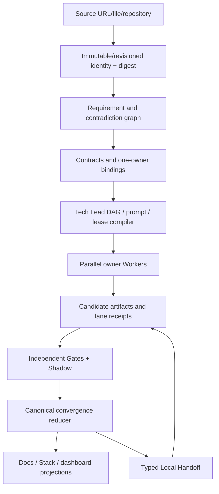

# Data flow

## Control-plane flow



## Authority flow

```text
Source/Google/GitHub navigation
  read-only/advisory
        ↓
versioned EAS machine records
  task/closure routing authority
        ↓
owner repositories
  implementation and exact runtime/effect evidence
        ↓
independent verification
  disagreement/readback authority
        ↓
Human/trusted policy
  merge/release/legal/security/egress/rollback authority
```

## Data-class flow

- `PUBLIC`: may enter public source/task packets after digest and policy.
- `INTERNAL`: stays on admitted internal routes.
- `CONFIDENTIAL`: requires explicit capability and sanitizer; never enters public receipts.
- `LOCAL_ONLY`: path/content/session/credential stays local; remote packets contain opaque handles or redacted metadata only.
- Secret values are never valid packet/artifact/trace/receipt content.

## External-effect flow

```text
validated candidate
→ WriteIntent
→ capability/policy/version/Gate check
→ idempotency/effect reservation
→ provider adapter
→ timeout/success/failure
→ remote readback
→ COMMITTED | UNKNOWN_EFFECT | COMPENSATION_REQUIRED | HUMAN_ESCALATE
```
