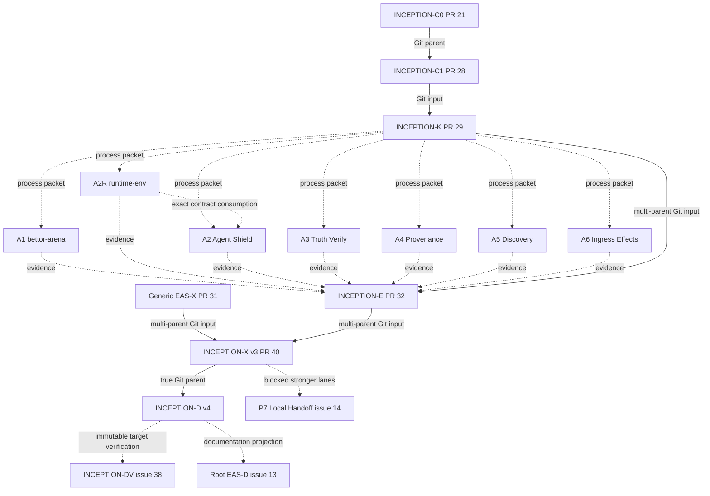
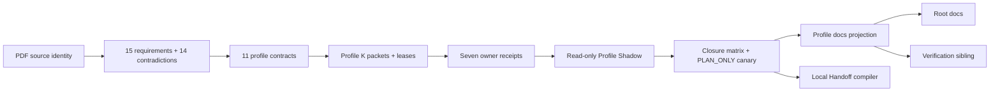

# Agent Thinking Inception — P6 Profile Documentation Convergence

Status: **P6 PROFILE DOCUMENTATION CANDIDATE**

Owner: `ed3c/enterprise_agent_system#23`

True Git parent:

```text
Profile-X PR #40
commit fe2748e09a5222f439f09c5d0d71e486e1ade3e8
tree   0425916bea831c125702696544ae2848fdf9bd0e
Shadow 4974017388
verdict ADMIT_FOR_P6_DOCUMENTATION_PREPARATION
```

This directory is an Agent-readable projection of current machine state. It may
route documentation and verification work; it cannot mutate runtime, workflow,
effect, verifier, Human, merge, release, or rollback state.

## Literal profile truth

```text
source class                    SOURCE_PROPOSAL
requirements                    15
contradictions                  14
stronger no-credit lanes        13
source-required lanes satisfied  1
requirement closure credit       0
profile Shadow                  ADMIT_FOR_PROFILE_CONVERGENCE
profile X                       ADMIT_FOR_P6_DOCUMENTATION_PREPARATION
Profile-X hosted Gate           ABSENT
vertical canary                 PLAN_ONLY
vertical execution receipt      null
highest profile projection      DETERMINISTIC_EVIDENCE_VERIFIED
full architecture               BLOCKED_FOR_CLOSURE
profile release                 NOT_ADMITTED
Human admission                 NOT_PERFORMED
merge / release / rollback      NOT_PERFORMED
```

Current vertical-canary contract:

```text
INCEPTION-X-PUBLIC-NO-EFFECT-001
sha256:7a881bbe4b2b9605d56838f5f1e9a3c76dbf45ebc1b0aa7a973fd1329f88efbb
```

The canary is public-only and reversible. It has no private data, provider
enrollment, production credential, external effect, or Human operation. Its seven
A1/A2R/A2/A3/A4/A5/A6 entries are `CONSTITUENT_RECEIPT_ONLY`; they are not an
integrated execution receipt.

## Current exact P4/P5 inputs

```text
Generic EAS-X PR #31
  commit 8b1bfa38c103e1c064b8ef0aafecfc8f2a2642dc
  tree   9c8fb0e8e25f357fdb695a94c4ab74fc3dcd4631
  Shadow 4973896050
  verdict ADMIT_FOR_PROFILE_X_REBIND

Profile-E PR #32
  commit 9f25b94ca891faf0d926b0fc22b67be88925aa81
  tree   1452d1b9931c70ef70ed3b7dec78cedc51d6db35
  Shadow 4973593318
  verdict ADMIT_FOR_PROFILE_CONVERGENCE

Profile-X PR #40
  commit fe2748e09a5222f439f09c5d0d71e486e1ade3e8
  tree   0425916bea831c125702696544ae2848fdf9bd0e
  Shadow 4974017388
  verdict ADMIT_FOR_P6_DOCUMENTATION_PREPARATION
```

The current A1 hosted run is `32259216877`. The value `32259476821` is stale
historical metadata discovered in an earlier generic-X parent and must never be
used as current A1 evidence.

## State Machine

```text
SOURCE_PROPOSAL
→ C0 SOURCE_AND_REQUIREMENT_GRAPH
→ C1 PROFILE_CONTRACT_LOCK
→ K PROFILE_DAG_AND_PACKET_COMPILER
→ A1/A2R/A2/A3/A4/A5/A6 PUBLIC OWNER RECEIPTS
→ E READ_ONLY_PROFILE_SHADOW
→ X PROFILE_CLOSURE_CANDIDATE
→ D PROFILE_DOCUMENTATION_PROJECTION
→ DV EXTERNAL_DOC_VERIFICATION
→ ROOT_D AGGREGATE_DOCUMENTATION_PROJECTION
→ P7 BOUNDED_LOCAL_HANDOFF_COMPILATION
→ HUMAN / RELEASE only with separate authority
```

No arrow above implies automatic closure promotion. Every transition is guarded by
the required evidence lane from the source requirement graph.

## DAG and Git ancestry



Solid `Git parent/input` edges are Git ancestry only where unmerged bytes are
actually consumed. Dotted edges are process, evidence, verification, projection,
or blocked-handoff dependencies and are **not** Git ancestry.

## Runtime/evidence data flow



Forbidden promotion routes include:

```text
SOURCE_PROPOSAL                    -X-> runtime truth
A1 public crash fixture            -X-> production/multi-host durability
A2 local process fixture           -X-> network/provider PASS
A3 deterministic semantic fixture  -X-> arbitrary business truth
A4 synthetic leak canary           -X-> ZERO_LEAKAGE or legal clearance
A5 matched synthetic benchmark     -X-> automatic promotion or Human Admit
A6 local effect test double        -X-> real external effect PASS
seven constituent receipts         -X-> integrated vertical execution
model/Judge agreement               -X-> Human admission
Profile-D documentation             -X-> canonical Task/Effect/Human state
Google Doc/Sheet projection         -X-> canonical Task/Effect/Human state
```

## Molecular Stack

Current profile delivery chain:

```text
INCEPTION-C0  PR #21
  ↓ true child
INCEPTION-C1  PR #28
  ↓ C1 + generic K inputs
INCEPTION-K   PR #29
  ├─ A1  bettor-arena PR #194
  ├─ A2R runtime-env PR #68
  ├─ A2  agent-shield-monorepo PR #154
  ├─ A3  truth-verify-loop PR #30
  ├─ A4  enterprise_agent_system PR #30
  ├─ A5  bettor-arena PR #195
  └─ A6  bettor-arena PR #196
        ↓ evidence denominator
INCEPTION-E   PR #32
        + fresh generic EAS-X PR #31
        ↓ true multi-parent input
INCEPTION-X v3 PR #40
        ↓ true child
INCEPTION-D v4 current branch
        ↓ external verification sibling #38
Root EAS-D #13
        ↓
P7 Local Handoff #14
```

The following remain visible with **no authority**:

```text
Profile-X old PR #33 / agent/inception-x-profile-convergence
Profile-X v2 PR #36 / agent/inception-x-profile-convergence-v2
Profile-D old PR #37
Profile-D verification old PR #39
agent/inception-d-profile-docs-v2   (misnamed stale Profile-X residue)
agent/inception-d-profile-docs-v3   (misnamed stale Profile-X residue)
```

No force rewrite is used to hide these histories.

## Machine authority

- `../plans/molecular-stack-index.json` — exact current Stack and typed relationships.
- `../plans/directory-state-machine-index.json` — directory/owner/State Machine/Gate/blocker/next-owner index.
- `../plans/data-flow.json` — guarded data and evidence graph plus forbidden edges.
- `../plans/closure-record.json` — inherited P5 v3 closure candidate; read-only to P6.
- `../plans/vertical-canary.json` — inherited P5 v3 `PLAN_ONLY` canary; read-only to P6.
- `../evidence/convergence/receipt-index.json` — inherited current P5 receipt index.
- `../prompts/README.md` — P0–P7 prompt catalogue.
- `../prompts/12-profile-docs-convergence.system.md` — zero-context P6 documentation prompt.

Prose is a projection of these machine facts, not the source of operational state.

## Directory ownership laws

- Source/requirements remain C0-owned.
- Contracts remain C1-owned.
- Orchestration remains K-owned.
- Runtime/effect/verifier behavior remains in its canonical owner repository.
- Profile-E is read-only and `may_commit=[]` for operational state.
- Profile-X owns convergence records only.
- Profile-D owns only its seven documentation paths.
- The Profile-D hosted verification workflow belongs to issue #38 and is an external sibling, not a Git parent.
- Root/shared README/AGENTS/architecture indexes belong to EAS-D #13.
- Local Handoff queue mutation belongs to #14 and remains unexecuted.
- Google Docs/Sheets, if projected later, are `ADVISORY_ONLY`.

## Evidence gaps that must remain visible

```text
physical power-loss / multi-host durability  NOT_EXERCISED
network / gVisor isolation                   NOT_EXERCISED
provider capability/enrollment               NOT_EXERCISED
external independent semantic                NOT_EXERCISED
private evidence                              NOT_EXERCISED
exact external Model/Data/Trace terms         UNBOUND
live telemetry export/store/delete           NOT_EXERCISED
external candidate benchmark                 NOT_EXERCISED
real external effect / remote readback       NOT_PERFORMED
compensation                                  NOT_EXERCISED
business/user outcome                         NOT_VERIFIED
Human legal/security/admission                HUMAN_ADMIT_REQUIRED
merge/release/rollback                        NOT_PERFORMED
```

A documentation or CI PASS cannot promote these lanes.

## P6 verification and handoff

Issue #23 does not own `.github/**`, so this branch does not create a workflow and
does not invent a hosted P6 PASS. Issue #38 owns a verification-only sibling whose
sole write lease is `.github/workflows/inception-d-verification.yml`; that workflow
must check out the immutable Profile-D target SHA and verify Profile-X v3 controls,
Profile-D docs controls, path lease, JSON parse, Python compile, and patch hygiene.

Only after that hosted sibling is green and a fresh read-only Shadow review binds the
same immutable Profile-D target may this profile documentation packet be handed to
root EAS-D #13. P7 #14 is recompiled only after profile and root documentation
converge.
