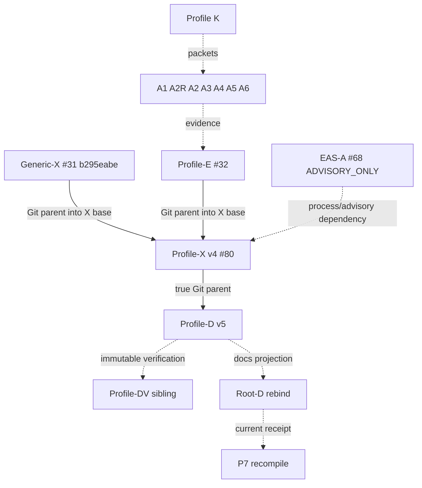

# Agent Thinking Inception — P6 Profile Documentation v5

Status: **PROFILE-D CANDIDATE AFTER EAS-A REBIND**

Owner: `ed3c/enterprise_agent_system#23`

## Exact parent

```text
Profile-X v4 PR #80
commit df4cd19d9acbedcbd0b00245b6339cc9ef7e99e0
tree   9290a2822ba30309a9d44933ce0ea4d640501a39
external exact-target verify 32321499909 PASS
Shadow review 4978282030
verdict ADMIT_FOR_PROFILE_D_REBIND_AFTER_EAS_A
Profile-X-owned hosted workflow ABSENT
```

The external verifier is evidence, not Git ancestry. This Profile-D branch is a
true Git child of the Profile-X v4 commit above.

## Literal profile truth

```text
source class                    SOURCE_PROPOSAL
requirements                    15
contradictions                  14
stronger no-credit lanes        13
source-required lanes satisfied  1
requirement closure credit       0
EAS-A                            ADVISORY_ONLY
EAS-A Git relationship           PROCESS_DEPENDENCY_NOT_GIT_PARENT
Google connectivity              NOT_PERFORMED
Google write                     NOT_PERFORMED
source correctness               NOT_PROVEN
vertical canary                  PLAN_ONLY
canary digest                     sha256:869842575cae80c62227699f576728f3331fa25a573a3cc27c052f23f32944c2
vertical execution receipt       null
highest profile projection       DETERMINISTIC_EVIDENCE_VERIFIED
full architecture                BLOCKED_FOR_CLOSURE
profile release                  NOT_ADMITTED
Human admission                  NOT_PERFORMED
merge / release / rollback       NOT_PERFORMED
```

## State Machine

```text
SOURCE_PROPOSAL
→ C0 REQUIREMENT_GRAPH
→ C1 PROFILE_CONTRACTS
→ K PROFILE_DAG_AND_PACKETS
→ A1/A2R/A2/A3/A4/A5/A6 PUBLIC RECEIPTS
→ E READ_ONLY_SHADOW
→ GENERIC_X + EAS_A ADVISORY REBIND
→ PROFILE_X_V4
→ PROFILE_D_V5
→ EXTERNAL_PROFILE_D_VERIFICATION
→ FRESH_SHADOW
→ ROOT_D_REBIND
→ P7 RECOMPILE
→ LOCAL / PROVIDER / HUMAN lanes only with their own receipts
```

No state above implies a stronger evidence class. `CURRENT` documentation is not
runtime completion.

## DAG / ancestry



Only solid Git-parent edges describe ancestry. EAS-A remains a process/advisory
input, never a third Profile-X parent.

## Guarded data flow

```text
source digest + locators
→ 15 requirements / 14 contradictions
→ strict contracts
→ Tech Lead packets and leases
→ exact owner receipts
→ read-only Shadow
→ Generic-X + EAS-A advisory reconciliation
→ Profile-X v4 closure matrix + PLAN_ONLY canary
→ Profile-D v5 projections
→ external Profile-D verification + Shadow
→ fresh Root-D / P7 only after exact readback
```

Forbidden promotion examples:

```text
EAS-A ADVISORY_ONLY       -X-> canonical task/effect/Human state
Google Doc/Sheet          -X-> closure credit
Google revision/read      -X-> source correctness
public owner receipt      -X-> integrated vertical execution
PLAN_ONLY canary          -X-> EXECUTED
CI green                  -X-> user/business outcome
model/Judge               -X-> Human admission
stale P7 #59              -X-> current Local Handoff execution
```

## Molecular Stack

```text
C0 #21 → C1 #28 → K #29
                   ├─ A1 bettor #194
                   ├─ A2R runtime-env #68
                   ├─ A2 Shield #154
                   ├─ A3 Truth Verify #30
                   ├─ A4 EAS #30
                   ├─ A5 bettor #195
                   └─ A6 bettor #196
                         ↓
                    Profile-E #32
                         +
Generic-X #31 b295eabe ← EAS-A #68 (process/advisory only)
                         ↓
                   Profile-X v4 #80
                         ↓
                   Profile-D v5
                         ↓
                  Root-D rebind
                         ↓
                    P7 recompile
```

Historical/no-current-authority denominator:

```text
Profile-X v3 #40         authority NONE
Profile-D v4 #44         authority NONE
Root-D v2 #57            authority NONE
P7 #59                    authority NONE
H3R #67                   authority NONE
H3RR #71                  authority NONE
rejected X base 7d8b4ab  PROFILE_SUBTREE_INCOMPLETE / authority NONE
```

## Machine authorities

- `../plans/closure-record.json` — inherited Profile-X v4 closure truth.
- `../plans/vertical-canary.json` — inherited PLAN_ONLY canary.
- `../evidence/convergence/receipt-index.json` — inherited P5 exact receipts.
- `../plans/molecular-stack-index.json` — P6 Stack projection.
- `../plans/directory-state-machine-index.json` — directory/State Machine/DAG routing.
- `../plans/data-flow.json` — guarded data/evidence routes.
- `../prompts/README.md` — profile prompt catalogue.
- `../prompts/12-profile-docs-convergence.system.md` — fresh-session P6 prompt.

## Evidence ceiling

Profile-D may prove documentation/traceability consistency only. Physical,
provider, private, external-effect, business/user, Human, merge, release and
rollback lanes remain unproven/unperformed.

A verification-only sibling must checkout the immutable Profile-D v5 target and
run inherited Profile-X v4 controls plus the Profile-D verifier/selftest. Only a
fresh exact-head Shadow `COMMENT` may hand the same subject to Root-D #13.
